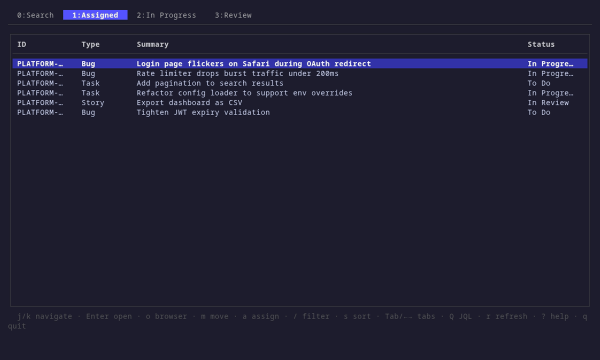

# jira-tabbed-tui

> A fast, keyboard-driven terminal UI for Jira — your triage board, in the terminal.

`jira-tabbed-tui` turns your everyday Jira queries into a set of live, tabbed
views you can fly through without ever touching the mouse. Define your tabs with
JQL, browse issues in a compact table, drill into full detail, and run the
common write actions — transition, assign, label, comment — right from the
keyboard. It rides on top of the [`jira` CLI][jira-cli] for reads and writes and
talks to the Jira REST API directly for the few things the CLI can't do.



> The clip above is recorded from the real TUI driven by a mock backend — no
> live Jira needed. Regenerate it any time with `vhs demo/demo.tape`
> (see [`demo/`](demo/)).

---

## Features

- **Tabbed JQL views** — every tab is a saved JQL query; switch with `Tab`,
  arrow keys, or a number key. Add, edit, and delete tabs on the fly.
- **Keyboard-first** — navigation, filtering, and all write actions are bound to
  single keys, every binding remappable via config.
- **Rich detail view** — description, comments, and links (including subtasks and
  remote/web links) split across body tabs, with a configurable sidebar of
  fields.
- **Write actions from the terminal** — change status (transitions), assign
  users, add labels, and post comments without leaving the app.
- **Fuzzy filtering** — instantly narrow the loaded rows with `/`.
- **Sorting** — reorder the current list by any column.
- **ADF rendering** — Atlassian Document Format bodies (Jira Cloud) are rendered
  as readable, styled terminal text; plain-string bodies work too.
- **Smart caching** — per-tab and per-issue results are cached with a 5-minute
  TTL, paginated on demand, and fall back to stale data (clearly flagged) when a
  refresh fails, so the UI stays responsive.
- **Field discovery** — dump the field name-to-ID mapping for any issue to build
  custom columns and sidebars, including `customfield_*` fields.
- **Open in browser** — jump straight to any issue on the web.

## Requirements

- **Go 1.25+** (only needed to build from source)
- **The [`jira` CLI][jira-cli]** (`ankitpokhrel/jira-cli`), installed,
  configured, and authenticated. `jira-tabbed-tui` shells out to it for reads and
  most writes.
- **A Jira API token**, for the REST calls the CLI doesn't cover (status
  transitions, assignable-user search, remote links). See
  [Authentication](#authentication).

## Installation

### From source

```sh
git clone https://github.com/clobrano/jira-tabbed-tui.git
cd jira-tabbed-tui
go build -o jira-tui .
```

Then move the resulting `jira-tui` binary somewhere on your `PATH`.

### With `go install`

```sh
go install github.com/clobrano/jira-tabbed-tui@latest
```

This installs a binary named `jira-tabbed-tui` into `$(go env GOPATH)/bin`.

## Getting started

1. Install and authenticate the `jira` CLI:

   ```sh
   jira init          # configure server + login
   jira me            # verify authentication works
   ```

2. Export your Jira API token (see [Authentication](#authentication)):

   ```sh
   export JIRA_API_TOKEN="your-token-here"
   ```

3. Run it:

   ```sh
   jira-tui
   ```

   On first launch, if no config file exists, a sensible default is written to
   `~/.config/jira-tui/config.yaml` and the app starts with two tabs:
   *Assigned* and *In Progress*.

At startup the app verifies that the CLI binary is on your `PATH` and runs a
cheap `jira me` auth check, so misconfiguration surfaces immediately with an
actionable error rather than a blank screen.

## Authentication

Reads and most writes go through the `jira` CLI, which manages its own
authentication (`jira init` / `jira auth login`). A few operations call the Jira
REST API directly and need an API token, resolved in this order:

1. The **`JIRA_API_TOKEN`** environment variable.
2. The **GNOME keyring** via `secret-tool` (looked up as service `jira-cli` with
   your login email), if the env var is unset.

The server URL and login email are read from the `jira` CLI's config
(`~/.config/.jira/.config.yml`) and can be overridden with `backend.url` in your
config.

> Generate an API token at
> <https://id.atlassian.com/manage-profile/security/api-tokens>.

## Configuration

Configuration lives at `~/.config/jira-tui/config.yaml` by default (override with
`--config /path/to/config.yaml`). The file is created with defaults on first run
if it doesn't exist.

```yaml
backend:
  cli: jira                            # the Jira CLI binary to shell out to
  # url: https://myorg.atlassian.net   # base URL for "open in browser" and REST calls
  # extra_args: []                     # extra args prepended to every CLI invocation

tabs:
  - name: Assigned
    jql: assignee = currentUser()
  - name: In Progress
    jql: assignee = currentUser() AND status = "In Progress"

list:
  # Available fields: key, type, summary, priority, status, assignee,
  #                   duedate, created, updated
  # `label` overrides the column header; `width` fixes the width in chars.
  # Omit `width` on exactly one column to let it expand and fill the row.
  columns:
    - field: key
      label: ID
    - field: type
    - field: summary
    - field: status

detail:
  sidebar_width: 33
  sidebar_fields:
    - field: assignee
    - field: reporter
    - field: labels
    - field: duedate
      label: Due

keybindings:
  # All optional — defaults shown. Override any you like.
  transition: m        # change status
  add_labels: l        # add labels
  add_comment: c       # add a comment
  assign: a            # assign the issue
  open_browser: o      # open in browser
  field_discovery: F   # list all fields for the selected issue
  force_refresh: r     # refresh the current tab
  help: "?"            # toggle the help overlay
  sort: s              # open the sort picker (list view)
```

### Custom fields in the sidebar

The sidebar accepts built-in fields (`assignee`, `reporter`, `labels`,
`duedate`, `priority`, `status`, `summary`, `issuetype`, `description`,
`created`, `updated`) and any `customfield_*` field. Unknown fields produce a
warning but don't stop the app. Use the `fields` command to discover the IDs of
custom fields:

```sh
jira-tui fields PROJ-123
```

This prints a field-name-to-ID mapping for the given issue (no TUI), which you
can paste straight into your `list.columns` or `detail.sidebar_fields`.

## Usage

Launch with `jira-tui` (or `jira-tabbed-tui`, depending on how you installed it).
Press `?` at any time for the context-sensitive keybindings overlay.

### Navigation

| Key           | Action                                        |
| ------------- | --------------------------------------------- |
| `j` / `↓`     | Move down                                     |
| `k` / `↑`     | Move up                                       |
| `Tab` / `←` `→` | Next / previous tab                         |
| `0`–`9`       | Jump to tab by index                          |
| `+`           | Add a new tab                                 |
| `-`           | Delete the current tab                        |
| `Q`           | Edit the current tab's JQL                     |
| `/`           | Fuzzy-filter the loaded rows                   |
| `Enter`       | Open issue detail                             |
| `r`           | Refresh the current tab                        |
| `?` / `Esc`   | Close the help overlay                         |
| `q` / `Ctrl+C`| Quit                                          |

### List view

| Key | Action                                      |
| --- | ------------------------------------------- |
| `o` | Open in browser (without entering detail)   |
| `m` | Change status                               |
| `a` | Assign issue                                |
| `s` | Sort the list                               |

### Detail view

| Key              | Action                                                    |
| ---------------- | -------------------------------------------------------- |
| `Esc`            | Back to list (clears navigation history)                 |
| `⌫` / `Ctrl+o`   | Navigate back in history                                 |
| `Ctrl+i`         | Navigate forward in history                              |
| `←` / `→`        | Switch body tab (Description / Comments / Links)         |
| `Enter`          | Open the linked issue (on the Links tab)                 |
| `o`              | Open in browser                                          |
| `m`              | Change status                                            |
| `a`              | Assign issue                                             |
| `l`              | Add labels                                               |
| `c`              | Add a comment                                            |
| `F`              | List all fields for the issue                            |

*(Action keys reflect the defaults; they follow whatever you set under
`keybindings` in your config.)*

## How it works

`jira-tabbed-tui` is a [Bubble Tea][bubbletea] application. At a glance:

- **`cmd/`** — the Cobra command tree: the root command that boots the TUI, plus
  the `fields` subcommand.
- **`config/`** — loading, validating, and defaulting the YAML config.
- **`backend/`** — everything that talks to Jira: a `Runner` that shells out to
  the `jira` CLI, JSON/ADF parsers, direct REST calls (transitions, assignable
  users, remote links), and a TTL cache that also handles pagination and
  stale-data fallback.
- **`model/`** — the plain data types (issues, comments, links, transitions,
  users, fields) shared across the app.
- **`tui/`** — the Bubble Tea views: tab bar, list, detail view with sidebar,
  search, status line, and the help overlay.

Reads use `jira issue list --raw` / `jira issue view --raw`; writes use
`jira issue move` / `edit` / `assign` / `comment add`. Operations the CLI doesn't
expose fall back to authenticated calls against `/rest/api/3/...`.

## Development

```sh
go build ./...     # build everything
go test ./...      # run the test suite
go vet ./...       # static checks
```

The backend ships with a `FakeRunner` test double so parsing, caching, and
command construction can be exercised without a live Jira instance.

## Contributing

Issues and pull requests are welcome. If you're adding a feature, a short note in
the PR describing the behavior and any new config keys goes a long way.

## License

No license file is currently included in this repository. If you intend to use
or distribute this project, please check with the author regarding licensing
terms.

[jira-cli]: https://github.com/ankitpokhrel/jira-cli
[bubbletea]: https://github.com/charmbracelet/bubbletea
